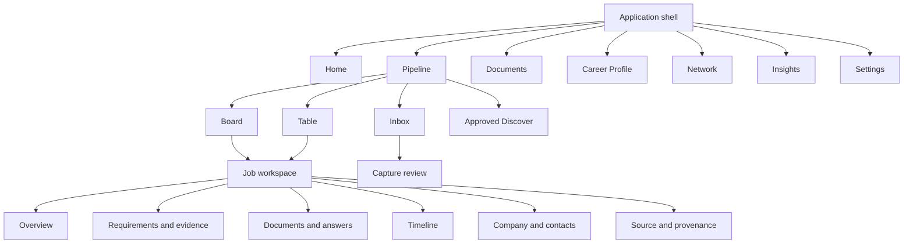

# 09 — Interface, layout, and interaction system

Status: proposed UI baseline; validate with low-fidelity usability tests before visual polish.  
Inputs: [competitive patterns](08-competitive-patterns.md), [product journeys](01-product-ui-and-journeys.md), and [goal](GOAL.md).

## 1. Design character

The product should feel like a calm, capable personal workspace: dense enough for a serious search, quiet enough for someone already under stress, and explicit whenever automation or uncertainty is involved.

### Design principles

1. **Next action before analytics.** The interface first answers “what should I look at now?”
2. **Context over navigation.** Open a job beside the pipeline when space allows instead of replacing the user's place.
3. **Progressive disclosure.** Advanced filters, provenance, prompt details, and policy records are reachable but not constantly expanded.
4. **Evidence is a visual primitive.** Source, confidence, user confirmation, and network destination have consistent chips/icons throughout the app.
5. **AI is an action, not a place.** Draft, compare, explain, or rewrite are contextual commands; there is no primary “AI chat” destination.
6. **State is not color alone.** Every status has text/icon/shape semantics and works in high contrast.
7. **No false certainty.** Ranges, partial matches, stale data, and unresolved conflicts look different from confirmed facts.
8. **Local-first is visible.** The shell always identifies the active vault and shows network activity before sensitive data leaves it.

## 2. Information architecture



### Desktop navigation

- Left rail is 240 px expanded and 64 px collapsed.
- Primary items: Home, Pipeline, Documents, Career Profile, Network, Insights.
- Bottom items: active vault selector/status, Help, Settings.
- Inbox appears as a badge on Pipeline, not a separate top-level item.
- Global Search and Command are fixed in the top utility bar.
- “Add” is a single primary button with options for manual job, paste, import, interaction, contact, and document.

### Mobile navigation

- Bottom bar: Home, Pipeline, Add, Documents, More.
- More contains Profile, Network, Insights, Settings, and vault controls.
- Job detail is a full route; no permanent side panel.
- Dense editing and multi-column comparisons can be viewed on mobile but may recommend desktop for large-document changes.

### Route model

Use stable local routes even when no server exists:

```text
/
/pipeline?view=board&savedView=...
/pipeline/inbox
/jobs/:jobId/:tab
/documents/:documentId
/profile/:section
/network/companies/:companyId
/network/contacts/:contactId
/insights/:report
/settings/:section
```

Opening a job from a wide Pipeline route uses a side workspace while preserving the URL. Refresh/deep-link opens the full job route; Back returns to the exact view, filters, scroll, and selection.

## 3. Application shell

```text
┌──────────────────┬────────────────────────────────────────────────────────────┐
│ Product / Vault  │ Search…        [⌘K]                    Local ▾   [+ Add]   │
│                  ├────────────────────────────────────────────────────────────┤
│ Home             │ Page header / tabs / saved view / filters                 │
│ Pipeline   3     ├────────────────────────────────────────────────────────────┤
│ Documents        │                                                            │
│ Career Profile   │ Main workspace                                             │
│ Network          │                                                            │
│ Insights         │                                                            │
│                  │                                                            │
│ Vault healthy    │                                                   Toasts   │
│ Help / Settings  │                                                            │
└──────────────────┴────────────────────────────────────────────────────────────┘
```

### Persistent shell indicators

- Vault badge: `Browser vault`, `Desktop vault`, or later `Synced vault`.
- Health state: healthy, backup due, storage risk, offline, migration required.
- Network state is shown only when relevant; it must not imply offline means broken.
- Extension outbox badge appears when captures are queued or need repair.
- An undo region receives reversible status/card edits for at least 10 seconds. The durable token does not expire merely because the affordance closes; a later recovery surface may consume it only while its exact post-edit preconditions still match.

## 4. Visual language

### Color

Use semantic tokens rather than component-specific hex values. The initial theme direction is a warm neutral canvas, white/near-white work surfaces, dark slate text, and one desaturated indigo or teal accent. Status colors are reserved for meaning.

| Token | Purpose |
|---|---|
| `canvas` / `surface` / `surface-raised` | page, panels, menus |
| `text` / `text-muted` / `text-subtle` | hierarchy with AA contrast |
| `accent` / `accent-hover` / `accent-soft` | selection and primary action |
| `success` | confirmed, restored, completed |
| `warning` | uncertain, stale, backup due |
| `danger` | destructive, unsupported claim, failed integrity |
| `info` | external processing, imported, informational |

Do not use green to mean “good fit” or red to mean “bad candidate.” Fit states use Strength, Partial, Gap, and Unknown labels with icons and explanatory text.

### Type and density

- Self-hosted Geist Sans (or system-ui fallback) and Geist Mono for identifiers/logs; no remote font request.
- Base text 14–16 px depending on density setting; never below 12 px for metadata.
- Two density modes: Comfortable default and Compact for tables/boards.
- Use an 8 px spacing rhythm with 4 px adjustments; hit targets remain at least 44×44 CSS px for touch.
- Radius hierarchy: 6 px inputs/chips, 10 px cards, 14 px large panels. Avoid pill shapes except tags/status.
- Shadows are rare; borders and surface changes establish hierarchy.

### Iconography and motion

- Lucide icon set with text labels for unfamiliar actions.
- Motion communicates causality: card move, panel open, successful transfer. Respect reduced-motion.
- No decorative particle effects, pulsing AI gradients, or typing theater.

## 5. Core surfaces

### Home

Home is an attention queue, not a report dashboard.

Order:

1. **Now:** next interview/deadline and at most three high-priority actions.
2. **Needs attention:** review captures, unsupported claims, failed transfer, stale follow-up, backup risk.
3. **This week:** compact agenda and application activity.
4. **Optional snapshot:** current pipeline counts and response timing.
5. **Continue:** recent jobs/documents.

Cards include one primary action and at most one secondary action. Users may hide goals and analytics. Empty Home invites Add a job, Import existing tracker, or Explore sample data.

### Pipeline shell

Header:

```text
Pipeline   [Inbox 3] [Board] [Table] [Discover]     Saved view ▾  Filter  Sort
                                                       Search jobs…  •••
```

- View switch changes presentation, not data.
- Filter chips remain visible and removable.
- Users can save/rename/duplicate a view; v1 ships All active, Needs action, Interviews, Waiting, and Closed.
- Bulk actions appear only after selection.
- Search is scoped to jobs/companies in this surface; global search stays in shell.

### Board

Default semantic stages:

1. Saved
2. Preparing
3. Applied
4. Interviewing
5. Offer
6. Closed

Closed contains Rejected, Withdrawn, Expired, and Declined outcomes. Users may create/reorder display stages, but each maps to one semantic category so insights remain coherent.

Card minimum:

- title and company;
- work mode/location;
- priority/interest marker;
- next action or deadline;
- age/last activity;
- warning badges for unreviewed source, missing document, or unsupported claim.

Dragging changes status after an accessible confirmation announcement and writes a timeline event. Keyboard move is available. Undo restores the status projections while retaining the original event as append-only history; the consumed undo token records that reversal. Columns virtualize when large and collapse when empty if the user chooses.

### Table

- Virtualized rows with sticky title/company columns.
- Configurable columns, widths, order, visibility, and pinned columns saved per view.
- Inline editing only for low-risk scalar fields such as status, priority, tags, and next-action date.
- Complex fields open the job workspace.
- Sorting, grouping, and validated nested filters never expose SQL.
- CSV export reports which view/filter produced the export.

### Inbox and capture review

```text
┌──────────────────────────┬────────────────────────────────────────────────────┐
│ Queue                    │ Captured job                         8/10 resolved │
│ [!] Acme — Engineer      │ Source snapshot | Extracted fields | Conflicts    │
│ [✓] North — Designer     │                                                    │
│ [ ] pasted listing       │ Title        Senior Engineer   High • JSON-LD     │
│                          │ Company      Acme              Confirmed by user  │
│ Snoozed                  │ Salary       120–150k          Medium • page text  │
│                          │ …                                                  │
│                          │ [Discard] [Snooze] [Merge…]       [Save job]       │
└──────────────────────────┴────────────────────────────────────────────────────┘
```

- Queue supports Accept, Merge, Snooze, and Discard.
- Review is field-based; “accept all high-confidence” never accepts unresolved conflicts.
- Source excerpts are sanitized text. A user can jump to the captured location in the source snapshot.
- The primary Save action lists remaining unknown/conflicting fields without forcing irrelevant fields.
- Discard is undoable until outbox/source cleanup is committed.

### Job workspace

Wide screens use a resizable 560–760 px side workspace over the Pipeline. Full page uses the same content components.

Header contains title, company, semantic status, priority, source/freshness, next action, and `•••`. Tabs:

- **Overview:** normalized facts, notes, deadline, compensation, next action, quick timeline entry.
- **Requirements:** requirement/evidence matrix and transparent coverage summary.
- **Documents:** selected application set, versions, answer drafts, export and submitted snapshot.
- **Timeline:** immutable events plus editable notes, reminders, interviews, and outcomes.
- **Company:** company notes, contacts, other roles, outcome history, salary observations.
- **Source:** captured snapshot, extracted candidates, provenance, diffs, refresh policy.

The most important job actions—Change status, Set next action, Prepare application—are always reachable without opening `•••`.

### Requirements and evidence

Avoid a single circular score as the primary visualization.

```text
Evidence coverage: 7 strengths · 3 partials · 2 gaps · 1 unknown

Requirement                         Type       Coverage   Evidence / Action
5+ years TypeScript                 Required   Strength   Role A (6 years)  ✓
Healthcare domain                   Desired    Gap        Accept gap / add evidence
Lead cross-functional delivery      Required   Partial    Project B; clarify scope
US work authorization               Required   Unknown    Answer privately
```

- Requirements are Required, Desired, Responsibility, Context, or Constraint.
- Coverage is Strength, Partial, Gap, Unknown, or Not Applicable.
- User can correct requirement type and link/unlink evidence.
- Literal term coverage is displayed separately from qualification evidence.
- Sensitive eligibility questions are not inferred from unrelated profile data.

### Document studio

```text
┌──────────────────────┬──────────────────────────────────┬─────────────────────┐
│ Requirements        │ Cover letter — Draft 3           │ Claim inspector     │
│ + selected evidence │ [structured editor]              │ 8 supported         │
│                     │                                  │ 1 needs review      │
│ Context plan        │                                  │ Tone / length       │
│ Data destination    │                                  │ Version history     │
└──────────────────────┴──────────────────────────────────┴─────────────────────┘
```

- Left pane assembles context; center edits; right pane explains claims and generation settings.
- User edits are never silently replaced. Regeneration creates a proposal/diff or a new version.
- Generated spans can show linked evidence on focus, without permanently painting the document.
- Actions: Draft, Revise selection, Shorten, Change tone, Explain, Compare, Accept diff, Reject diff.
- Export preview shows pagination and warns about unsupported formatting.
- Mark Applied prompts the user to snapshot the exact resume, letter, and answers actually submitted.

### Career Profile

Sections: Basics, Work, Education, Projects, Skills, Accomplishments, Certifications, Publications, Volunteering, Stories, Answer Library, Preferences.

- Profile completeness is descriptive, not a score.
- Imported records enter a proposal queue with source and confidence.
- Evidence cards distinguish Imported, User-confirmed, Source-backed, and Stale.
- Stories use Situation / Action / Result / Skills / Metrics, with optional privacy tags.
- Preferences distinguish hard constraints from nice-to-haves and never become public documents automatically.

### Documents

Views: All, Resumes, Cover letters, Answers, Templates, Submitted. Each item shows base/template lineage, related job, last edited, export status, and whether it contains unresolved claims.

- A reusable base document and a job-specific derivative are visibly different.
- Search includes text and linked evidence.
- Destructive changes create recoverable revisions; permanent purge is explicit.

### Network

Tabs: Companies, Contacts, Interactions.

- Company detail relates jobs, contacts, notes, public facts, sources, salary observations, and outcomes.
- Contact detail shows only user-entered, explicitly public, or licensed fields with provenance.
- Interaction composer supports note, call, email logged, meeting, referral, and follow-up; no v1 sending.
- A relationship reminder can be snoozed or disabled without negative language.

### Insights

Default reports:

- pipeline counts and conversion between semantic stages;
- response and time-in-stage distributions;
- source outcomes with sample size;
- application activity over time;
- salary ranges and outcomes with currency/unit caveats;
- evidence/skill gaps across saved target roles;
- extraction correction rates by connector for diagnostics.

Every chart links to underlying records. Small samples are labeled. The app does not imply causation from observational personal data.

### Settings

Sections: Vault & Backup, Privacy & Network, AI Providers, Sources & Extension, Appearance & Accessibility, Pipeline, Imports/Exports, Diagnostics, About.

Vault & Backup begins with a plain-language card:

```text
Your data is stored in: Desktop vault on this computer
Last verified backup: 4 days ago
[Back up now] [Export portable archive] [Test restore]
```

Network-enabled settings show default-off toggles, exact data categories, destination, credential location, last use, and disable/delete controls.

Diagnostics explicitly says that events stay local and contain only reviewed operational fields. Copy support bundle is a user-initiated action that copies versioned pretty JSON for at most the newest 200 events; the surface previews event count, application version, generation time, and the no-automatic-send guarantee. It never offers raw logs, paths, free-text exception messages, or job/applicant content. Any future telemetry control is separate, default off, and must not be implied by local bundle copy.

## 6. First-run design

Offer two tracks rather than one mandatory wizard.

### Quick start

1. Explain local storage in one screen.
2. Create vault with safe defaults.
3. Add/paste/capture a first job.
4. Review it and arrive on its Overview.
5. Prompt for Career Profile import only when the user asks to compare or draft.

### Guided setup

1. Choose browser or desktop mode and understand device scope.
2. Name vault and configure optional lock/backup.
3. Import resume and existing tracker.
4. Review evidence proposals.
5. Select AI-disabled, local, or BYOK mode with a data-flow preview.
6. Install/pair extension.

Both tracks are skippable and converge on Home. Sample data is a separate disposable demo vault, never mixed into the user's vault.

## 7. Extension interface

Use the browser side panel where supported; fall back to an action popup plus app review.

States:

1. **Not a recognized job:** Capture selected text, Capture page manually, or Close.
2. **Recognized:** preview title/company/location/salary/source and confidence.
3. **Needs input:** highlight missing/conflicting title/company and allow selection from page.
4. **Queued:** show local outbox, retry, export capture, and open workspace.
5. **Transferred:** link to the job/inbox; do not retain full content after acknowledgement and configured expiry.
6. **Permission needed:** explain exact host/permission and offer manual capture instead.

The button never says “Apply” unless a future, separately designed autofill feature is active. Baseline labels are Capture job and Send to Workspace.

## 8. Network and AI preflight

Before the first use of each provider/connector, show:

- what will be sent;
- where it will go;
- why it is needed;
- which secret/credential is used and where it is stored;
- whether the provider may retain data, with link to current policy;
- available local/manual alternative;
- Remember this choice checkbox, off for especially sensitive actions.

Per-run UI shows Cancel, retry safety, model/provider, context categories, and result provenance. Raw prompts may be inspectable in Advanced details but must redact secrets.

## 9. Keyboard and command model

Baseline shortcuts (platform-adapted and remappable later):

| Shortcut | Action |
|---|---|
| `Mod+K` | Command palette |
| `Mod+/` | Global search |
| `C` | Add/capture menu when not editing text |
| `G then H/P/D/R/I` | Go to Home/Pipeline/Documents/Profile/Insights |
| `J` / `K` | Next/previous record in lists and board columns |
| `Enter` | Open selected job |
| `Esc` | Close peek/menu or return focus |
| `E` | Edit selected safe field/job |
| `M` | Move status menu |
| `N` | Set next action |
| `?` | Shortcut reference |

Commands declare when unavailable and why. Focus returns to the invoking element after closing panels. Drag-and-drop always has a keyboard equivalent.

## 10. Content design

- Use “job,” “application,” “evidence,” “draft,” and “source” consistently.
- Prefer “Unknown” over “Missing” when the app lacks information.
- Prefer “Evidence coverage” over “match score,” “ATS score,” or “fit probability.”
- Say “Draft with AI” rather than “Write perfectly.”
- Say “Needs your review” rather than “AI failed.”
- Destructive actions name the affected vault/job/document and recovery window.
- Empty states offer a meaningful action, not a celebration of emptiness.
- Avoid judgmental language about application counts, gaps, rejections, or inactivity.

## 11. Accessibility baseline

- WCAG 2.2 AA target and automated axe checks plus manual keyboard/screen-reader testing.
- Semantic tables for Table view; board has list/group semantics and announced moves.
- 3:1 non-text and 4.5:1 normal-text contrast minimum unless a stricter rule applies.
- Visible focus ring unaffected by theme.
- Error summaries link to fields; errors are not color-only.
- Charts provide table equivalents and useful accessible names.
- Tooltips never contain information unavailable elsewhere.
- Reduced motion, 200% zoom/browser text resizing, the separate 320 CSS-pixel reflow case (approximately 400% zoom), Windows high contrast, and screen magnification are in the release matrix.
- Time limits are avoided; outbox expiry is long, visible, and exportable.

## 12. Responsive breakpoints

Breakpoints are content-derived starting points, not device assumptions:

- `< 640`: single pane, bottom navigation, full-page job detail.
- `640–959`: compact rail/menu, single primary pane, optional overlay detail.
- `960–1279`: sidebar plus workspace; job detail may overlay at 560 px.
- `1280–1599`: split Pipeline + resizable job workspace.
- `≥ 1600`: wider table/board and up to three panes in document studio.

At every width, source/provenance and data-destination controls remain reachable; they are not desktop-only safety features.

## 13. Loading, optimistic updates, and errors

- Local scalar edits may be optimistic if an undo and durable failure recovery exist.
- Status moves write status, timeline event, and a fresh durable undo token in one transaction. Undo restores projections and consumes the token without rewriting the event.
- Imports, generation, extraction, restore, and migrations show explicit progress and cancellation semantics.
- Skeletons are used only for expected short loads; longer work shows named stages.
- Errors preserve user text and include Retry, Copy diagnostics, Export fallback, or Manual path as applicable. Copy diagnostics uses only the bounded redacted support-bundle contract and never copies error free text, paths, or user content.
- Background work persists resumable checkpoints when possible.
- Toasts never carry the only copy of important information; failures also enter Home/diagnostics.

## 14. Usability-validation plan

Test low-fidelity prototypes with at least five representative users per major iteration, including one keyboard-heavy user and one user unfamiliar with developer terminology.

Tasks:

1. create a vault and explain where data lives;
2. add a first job without completing profile setup;
3. review a conflicting salary/title capture;
4. move a job and set a next action;
5. find the exact resume submitted to a past job;
6. explain a Strength, Partial, Gap, and Unknown result;
7. draft and correct an unsupported claim;
8. identify what will leave the device before an AI request;
9. export a backup and locate restore;
10. recover a queued extension capture.

Record completion, wrong turns, language misunderstandings, perceived trust, and stress—not only speed.

## 15. UI definition of done

A screen/journey is complete only when it has:

- default, loading, empty, partial, error, offline, and permission-denied states as relevant;
- keyboard and screen-reader path;
- responsive behavior at the five ranges above;
- safe focus restoration and Back/refresh behavior;
- user-visible provenance/destination where relevant;
- destructive-action and undo/recovery behavior;
- analytics/diagnostics that do not include private content;
- component, integration, and E2E coverage proportional to risk;
- updated screenshots or story states in the design/dev catalog;
- linked checklist proof.
